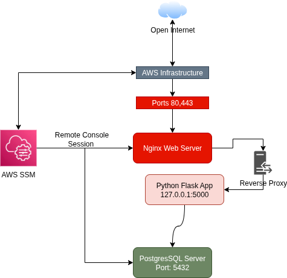

# D...... ... Technical Challenge

Using DevOps and SecOps principles and best practices.
• Create a Terraform project that:
- Creates a VPC and its relevant infrastructure to allow traffic to flow. (demonstrate
basics AWS fundamentals)
- Create an nginx host that best exposes the default nginx site.
- Try and adhere to security best practices.
- Create a PostgreSQL instance that the site would be able to get to.
• Create a script in a scripting language of your choosing, that would ascertain the
health status of the above nginx host and its implementation and updates the text of
the exposed home page


# AWS Infrastructure Setup Goals
### Overview
This document describes the configuration of an AWS infrastructure setup utilizing the Free Tier to avoid costs. It includes an Nginx web server hosting a Python application and a PostgreSQL database server, with strict network and security controls.


### Nginx Web Server with Python Application
- **Deployment**: Hosted on an AWS EC2 instance in a public subnet.
- **Public IP**: Configured with a random public IP (`associate_public_ip_address = true`).
- **Access**: Only ports 80 (HTTP) and 443 (HTTPS) are open to external traffic.

### PostgreSQL Server
- **Deployment**: Hosted on a separate EC2 instance in a private subnet for isolation.
- **Purpose**: Serves data exclusively to the Nginx server.
- **Access**: Restricted to port 5432, accessible only from the Nginx server.

## Network Configuration
- **Subnets**:
  - Nginx resides in a public subnet.
  - PostgreSQL resides in a private subnet for enhanced security.
- **Public Exposure**: Only the Nginx server's public IP is externally reachable, limited to ports 80 and 443.

## Security
- **SSH Access**: Disabled via policy; access is restricted to AWS Systems Manager (SSM).
- **Ingress Rules**:
  - **Nginx**: Only ports 80 and 443 are open to any source.
  - **PostgreSQL**: Only port 5432 is open, and only to the Nginx server.

## Notes
- **Free Tier**: This setup leverages AWS Free Tier services to avoid billing, with no paid services included.
- **Production Considerations**:
  - In a production environment, consider using a managed NAT Gateway (billable) or a separate EC2 instance with an ACL-controlled proxy server (restricted to specific URLs, such as update services) as needed.


<br/><br/> 

# Solution Architecture    




<br/><br/> 

# Software Clients Installation and Setup

## Amazon AWS CLI Client

```bash
sudo apt update && sudo apt install -y unzip curl

curl "https://awscli.amazonaws.com/awscli-exe-linux-x86_64.zip" -o "awscliv2.zip" && unzip awscliv2.zip
sudo ./aws/install
aws --version

aws configure --profile devoptest    
export AWS_PROFILE=devoptest
export AWS_REGION=af-south-1     
```

## Amazon SSM (Session Manager Plugin)

Used to connect to the VM instance since i am disabling SSH (port 22) by default

```bash
curl -fsSL "https://s3.amazonaws.com/session-manager-downloads/plugin/latest/ubuntu_64bit/session-manager-plugin.deb" -o session-manager-plugin.deb
sudo dpkg -i session-manager-plugin.deb
session-manager-plugin --version
```

<br/><br/> 


# AWS devops user privileges 

User: dischem-devops

## Installed Policies:

Note: This setup uses basic access controls sufficient for functionality, without implementing fine-grained permissions.

## List assigned policies to user
```bash
aws iam list-attached-user-policies --user-name dischem-devops --output table
```

```
AmazonEC2FullAccess
AmazonSSMReadOnlyAccess
IAMFullAccess
AmazonSSMManagedInstanceCore
AmazonSSMFullAccess
```

<br/><br/> 

# Terraform CLI Client Install

```bash
sudo apt-get update && sudo apt-get install -y gnupg software-properties-common

wget -O- https://apt.releases.hashicorp.com/gpg | \
gpg --dearmor | \
sudo tee /usr/share/keyrings/hashicorp-archive-keyring.gpg > /dev/null

gpg --no-default-keyring \
--keyring /usr/share/keyrings/hashicorp-archive-keyring.gpg \
--fingerprint

echo "deb [arch=$(dpkg --print-architecture) signed-by=/usr/share/keyrings/hashicorp-archive-keyring.gpg] https://apt.releases.hashicorp.com $(grep -oP '(?<=DEBIAN_CODENAME=).*' /etc/os-release || lsb_release -cs) main" | sudo tee /etc/apt/sources.list.d/hashicorp.list

sudo apt update && sudo apt-get install terraform

terraform -version
```

# Terraform Project Folder layout

```
terraform-nginx-pg/
├─ main.tf
├─ variables.tf
├─ outputs.tf
├─ terraform.tfvars.example
└─ modules/
   ├─ network/
   │  ├─ main.tf
   │  ├─ variables.tf
   │  └─ outputs.tf
   ├─ security/
   │  ├─ main.tf
   │  ├─ variables.tf
   │  └─ outputs.tf
   └─ compute/
      ├─ main.tf
      ├─ variables.tf
      └─ outputs.tf
```


<br/><br/> 

# Terraform Code

Setup AWS CLI
```bash
export AWS_PROFILE=devoptest
export AWS_REGION=af-south-1
```
Setup Terraform Secure Variables Values

```bash
export TF_VAR_db_password='xxxx'
export TF_VAR_git_pat='github_pat_11xxx...'
```

Initialise Terraform and modules, verify code

```bash
terraform init
terraform fmt -recursive && terraform validate
```

# Run Terraform code

Build infrastructure 

```bash
terraform apply 
terraform destroy
```
 
## Update the Application using terraform

This will update the python application from GitHub and restart services for the change

```bash
terraform apply -var="update_app=true"
```


# Issue while creating this
- free tier does not allow a nat router without costs, work around was SSM
- SSM copying the dummy app to the nginx host does not work for some reason 
- AWS Secrets Manager not free

# Git Repos

This is a private Git repository that is accessible using thr PAT token. a copy of the application was put into the public terraform repository for reference

https://github.com/riaanp78/dummyapp


<br/><br/> 


# State Testing (Quality Assurance)

I wanted to ensure I get a consistent build no matter what I change. This is build around my test Python app and how it functions. 

## Web Server

Force the web server to be rebuild by tainting it, this will generate new configs on build and regenerate the webserver config.ini dynamically and setup the services initially

```bash
terraform taint aws_instance.nginx
terraform apply"
```

## Database Server

Force the database server to be rebuild by tainting it, this will generate new configs on build and regenerate the webserver config.ini dynamically and restart the services for the new changes,

```bash
terraform taint aws_instance.postgres
terraform apply -var="update_app=true"
```

## All Servers

Rebuild all servers from scratch

```bash
terraform destroy
terraform apply
```